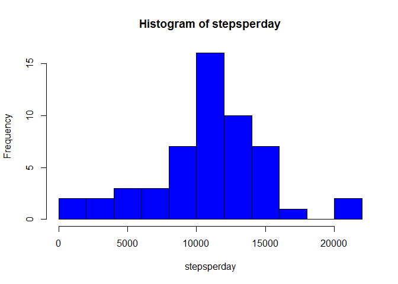
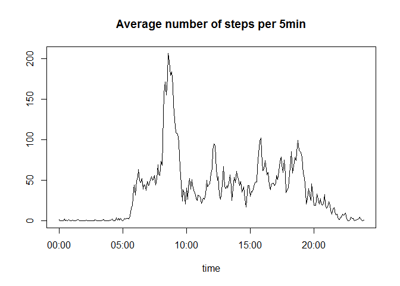
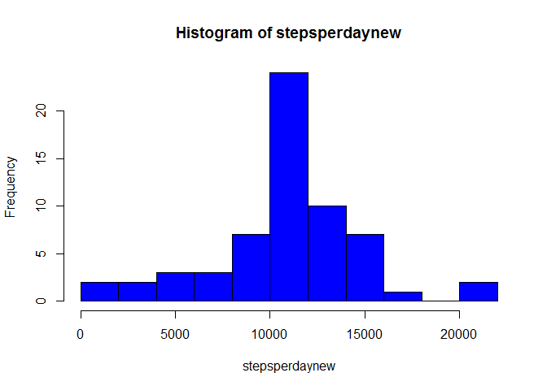
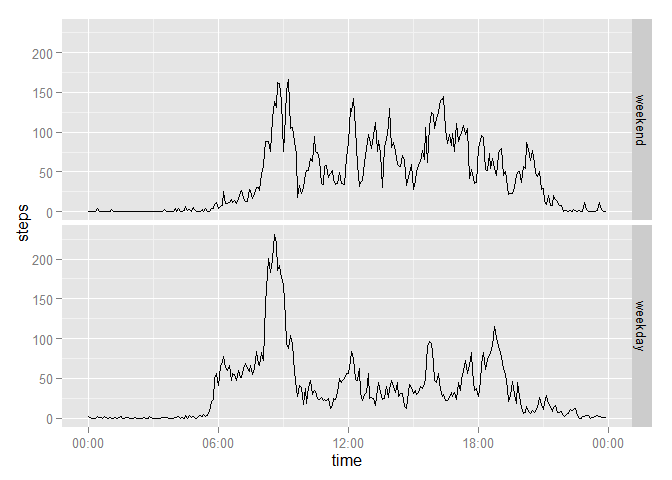

# Reproducible Research: Peer Assessment 1


## Loading and preprocessing the data

```r
library(ggplot2)
library(scales)

activity <-read.csv("activity.csv", stringsAsFactors=FALSE)
## formatting the date and time
intToHHMM <- function (i) {  sprintf("%02d:%02d", i %/% 100, i %% 100)}
activity$interval <- intToHHMM(activity$interval)
activity$datetime <- paste(activity$date, activity$interval)
activity$datetime <- strptime(activity$datetime, "%Y-%m-%d %H:%M")
```

## What is mean total number of steps taken per day?

```r
stepsperday <- with(activity, tapply(X=steps, date, sum))
hist(stepsperday, n=10, col="blue")
```

 

```r
median(stepsperday, na.rm=TRUE)
```

```
## [1] 10765
```

```r
mean(stepsperday, na.rm=TRUE)
```

```
## [1] 10766.19
```
## What is the average daily activity pattern?

```r
stepspertime <- with(activity, tapply(X=steps, interval, mean, na.rm=TRUE))
time <- strptime(names(stepspertime), "%H:%M")
plot(time, stepspertime, type="l", main="Average number of steps per 5min",
        ylab="")
```

 

```r
## Calculating the maximum number of steps for an average day
stepspertime[which(stepspertime==max(stepspertime))]
```

```
##    08:35 
## 206.1698
```
## Imputing missing values

```r
## Calculating the number of NA's
sum(is.na(activity$steps))
```

```
## [1] 2304
```

```r
## Creating a new dataset where the NA's are filled with the average daily
## activity patern
newactivity <- activity
for (i in 1:length(newactivity[,1])) {
        if (is.na(newactivity$steps[i])==TRUE){
                newactivity$steps[i] <-stepspertime[newactivity$interval[i]]
        }
}
## Make histogram, median and mean with the repared dataset
stepsperdaynew <- with(newactivity, tapply(X=steps, date, sum))
hist(stepsperdaynew, n=10, col="blue")
```

 

```r
median(stepsperdaynew, na.rm=TRUE)
```

```
## [1] 10766.19
```

```r
mean(stepsperdaynew, na.rm=TRUE)
```

```
## [1] 10766.19
```
## Are there differences in activity patterns between weekdays and weekends?

```r
## Add daytype variable to the dataset newactivity
Sys.setlocale("LC_TIME", "English")
```

```
## [1] "English_United States.1252"
```

```r
weekday <- factor("weekday", levels= c("weekend", "weekday"))
weekend <- factor("weekend", levels= c("weekend", "weekday"))
newactivity$daytype <- rep(weekday,length(newactivity[,1]))
newactivity$daytype[weekdays(newactivity$datetime) %in%
        c("Saturday", "Sunday")] <- weekend
stepsperdaytype <- with(newactivity, tapply(steps, INDEX=list(interval,daytype),
        FUN= mean, na.rm=TRUE))
stepsperdaytype <- as.data.frame(stepsperdaytype)
stepsweekend <- data.frame(time,steps=stepsperdaytype$weekend,daytype=weekend)
stepsweekdays<- data.frame(time,steps=stepsperdaytype$weekday,daytype=weekday)
stepsperdaytype <- rbind(stepsweekend,stepsweekdays)
stepsperdaytype$time <- as.POSIXct(stepsperdaytype$time, tz="", format="%H:%M")
ggplot(data=stepsperdaytype, aes(x=time,y=steps)) + geom_line() + 
        facet_grid(daytype~.) + scale_x_datetime(labels=date_format("%H:%M"))
```

 
